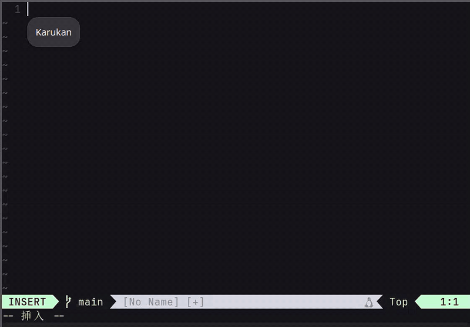

<div align="center">
  
  <h1>Karukan feat. Rakukan</h1>
  <p>Linux・macOS向け日本語入力システム — ニューラルかな漢字変換エンジン</p>
  <p><a href="https://github.com/togatoga/karukan">togatoga/karukan</a> の派生リポジトリ — Windows向け実装 <a href="https://github.com/fukuyori/rakukan">Rakukan</a> の知見から有効な機能だけを選択移植</p>

  [](LICENSE-MIT)
</div>

<div align="center">
  
</div>

## このリポジトリについて

本流の開発は上流 [togatoga/karukan](https://github.com/togatoga/karukan) で行われています。このリポジトリは Karukan を置き換えるものではなく、Windows 向け実装 [Rakukan](https://github.com/fukuyori/rakukan) の実装・運用実績から **Linux / macOS 版 Karukan に有効な機能だけを検証・移植する派生リポジトリ**です。ここで安定性と効果を確認できた変更は、上流へ還元できる形に保っています。

| リポジトリ | 役割 |
|---|---|
| [togatoga/karukan](https://github.com/togatoga/karukan) | 上流(本流の開発) |
| **fukuyori/karukan-feat-rakukan**(このリポジトリ) | Rakukan 機能の選択移植・検証 |
| [fukuyori/rakukan](https://github.com/fukuyori/rakukan) | Windows 向け実装・移植元の参照 |

計画と検証条件は [Rakukan 機能の選択移植計画](docs/rakukan-porting-plan.md) にまとまっています。

## 派生リポジトリでの追加機能

上流 Karukan の機能に加えて、次を実装済みです(2026-08-24 時点、全フェーズ完了)。

### 変換品質の安全網(Phase 1)

- **読み長に応じた生成予算**: 長い読みでも出力が途中で切れず、異常入力でも推論時間が無制限に伸びない
- **EOS 未到達候補の除外**: 生成上限で打ち切られた途中切れの文章を候補に出さない
- **退化候補フィルタ**: 入力のかなエコー・読みに無い反復・極端な長短・ルビ状出力を候補から除外(「わかったわかった」のような正当な反復は通す)
- **context エコー対策**: 未変換かな文が変換コンテキストに混じったときの変換崩壊を抑制

### 学習履歴とユーザー辞書(Phase 2)

- **`stale_days`**: 一定期間使わなかった学習エントリを起動時に整理(既定は無効)
- **ソース別学習方針**: 変換が得られなかったときの読みフォールバック確定や、候補ウィンドウなしのライブ変換確定を学習しない — 誤学習と誤った第一候補の自己強化を防止
- **ユーザー辞書の hot reload**: `user_dicts/` のファイル追加・編集・削除が **IME を再起動せずに**数秒で反映。壊れたファイルは直前の正常な内容を使い続ける

### F6–F10 変換(Phase 3)

- **F6 / F7 / F8**: 入力全体をひらがな / 全角カタカナ / 半角カタカナに変換
- **F9 / F10**: **打鍵したキーそのまま**を全角 / 半角英数に変換(`watasi` と打った「わたし」→ `watasi`)。再押下で小文字 → 大文字 → 先頭大文字を巡回
- 実現のため、IME の入力バッファに生打鍵履歴(mozc の raw input 相当)を実装

### 範囲指定変換(Phase 4)

- **Shift+→ / Shift+←** で読みの先頭から選択範囲を伸縮、**Space** で選択部分だけを変換、**Enter** で部分確定 — 残りの読みはそのまま入力が続き、ライブ変換が再開する
- Rakukan(TSF)では実装に失敗した機能を、エンジン内の状態設計として再設計

### モデル(Phase 5-B)

- **F16 variant**: `jinen-v2-small-f16` / `jinen-v2-xsmall-f16` を選択可能(既定は Q5 のまま。実測では greedy 出力は Q5 と完全一致で、Q5 既定が妥当)
- インストール時のモデル prefetch を「設定が使うモデルだけ」に絞り、大きな variant の追加でインストールが重くならない構成に変更

### その他

- **バージョン表記**: 動作中のビルドが `0.1.0+<git hash>` 形式でログと初回ロード表示に出る

## 特徴(上流 Karukan 由来)

- **ニューラルかな漢字変換**: GPT-2/Qwen3ベースのモデルをllama.cppで推論し、高度な日本語変換
- **ライブ変換**: 入力と同時に変換結果をリアルタイム表示。Spaceを押さずに変換が進む（`Ctrl+Shift+L` でON/OFF）
- **コンテキスト対応**: 周辺テキストを考慮した日本語変換
- **変換学習**: ユーザーが選択した変換結果を記憶し、次回以降の変換で優先表示。予測変換（前方一致）にも対応
- **システム辞書**: [SudachiDict](https://github.com/WorksApplications/SudachiDict)の辞書データからシステム辞書を構築
- **候補リライター (Mozcから移植)**: 半角カタカナ、英字の大文字小文字・全角半角、記号の関連候補、数字の各種表記（漢数字・大字・ローマ数字・丸数字・16/8/2進数）を自動生成
- **絵文字入力**: かな読み（`ぴえん` → 🥺）と Slack 風 `:trigger` クエリ（`:smile` → 😄）の両方をサポート

> **Note:** 初回起動時にHugging Faceからモデルをバックグラウンドでダウンロードします。ダウンロード中もかな入力と辞書変換はそのまま使え、モデルの読み込みが完了すると自動でニューラル変換が有効になります。ネットワークを使うのはこの初回ダウンロードだけで、2回目以降はダウンロード済みのモデルが使われます。

## プロジェクト構成

IME本体(コアエンジン + 各プラットフォームのフロントエンド)は `karukan-im/` 配下にまとまっています。

- [karukan-im/](karukan-im/) — IME本体
  - [core/](karukan-im/core/) — 共有IMEエンジン(crate: `karukan-im`) — ステートマシン、ローマ字変換、karukan-imserver(macOS向けJSON-RPCサーバー)
  - [fcitx5/](karukan-im/fcitx5/) — Linux向けフロントエンド(crate: `karukan-fcitx5`) — fcitx5アドオン + C FFI
  - [macos/](karukan-im/macos/) — macOS向けフロントエンド — Swift/InputMethodKit
- [karukan-engine/](karukan-engine/) — コアライブラリ — ローマ字→ひらがな変換 + llama.cppによるニューラルかな漢字変換
- [karukan-cli/](karukan-cli/) — CLIツール・サーバー — 辞書ビルド、Sudachi辞書生成、辞書ビューア、AJIMEE-Bench、HTTPサーバー

## インストール

- **Linux (fcitx5)**: [karukan-fcitx5 の README](karukan-im/fcitx5/README.md#install) を参照
- **macOS**: [karukan-macos の README](karukan-im/macos/README.md) を参照

## ドキュメント

- [キーバインド一覧](docs/key-bindings.md) — 共通キーバインド（F6–F10・範囲指定変換を含む）と Linux / macOS 固有キー
- [設定](docs/configuration.md) — config.toml の設定項目、ライブ変換、変換ストラテジー、学習キャッシュ、モデル一覧
- [辞書](docs/dictionary.md) — システム辞書のインストール、ユーザー辞書、候補の優先順位
- [ユーザー辞書](docs/user-dictionary.md) — 対応形式（Mozc/Google IME TSV・バイナリ）、hot reload、登録方法
- [Chunk](docs/chunking.md) — 変換が Chunk に区切られる場所と、自分で区切って表示を固定する方法
- [記号・半角全角](docs/symbols.md) — 句読点や括弧の種類、記号・数字・英字の幅、スペースの設定
- [Rakukan 機能の選択移植計画](docs/rakukan-porting-plan.md) — 派生リポジトリの位置づけ、移植範囲、各フェーズの設計と検証条件
- [Karukan からの変更点解説](docs/rakukan-implementation-notes.md) — 上流 Karukan からどこをどう修正したかの技術解説（従来動作・修正内容・理由・実装のポイント・挙動の違い）
- [基準出力](docs/baselines/README.md) — 変換品質変更の比較に使う異常入力ケース集と基準出力

## 開発

```bash
cargo build --release       # 全crateをビルド
cargo test --workspace      # 全テスト(モデル未取得の環境ではモデル依存テストは自動スキップ)
```

ブランチ運用: 公開済みの `main` は rebase せず、上流 `togatoga/karukan` を定期的に merge して追従します。機能はフェーズ単位の feature ブランチ(`feat/rakukan-*`)で実装し、PR で `main` へ取り込みます。上流同期と機能移植は同じコミットに混ぜません。

## ライセンス

MIT OR Apache-2.0 のデュアルライセンスで提供しています。

- [MIT License](LICENSE-MIT)
- [Apache License 2.0](LICENSE-APACHE)

Rakukan(MIT)由来の変更は、アイデア・仕様の参照に留めて Karukan の構造へ独自実装しており、参照元はコミットメッセージに記録しています。

[karukan-engine/data/](karukan-engine/data/) 配下には [Mozc](https://github.com/google/mozc) から派生したデータを含み、こちらは [BSD 3-Clause License](http://opensource.org/licenses/BSD-3-Clause) のもとで配布されています。各派生ファイルの由来およびMozcの著作権表記は [THIRD_PARTY_LICENSES](THIRD_PARTY_LICENSES) を参照してください。
